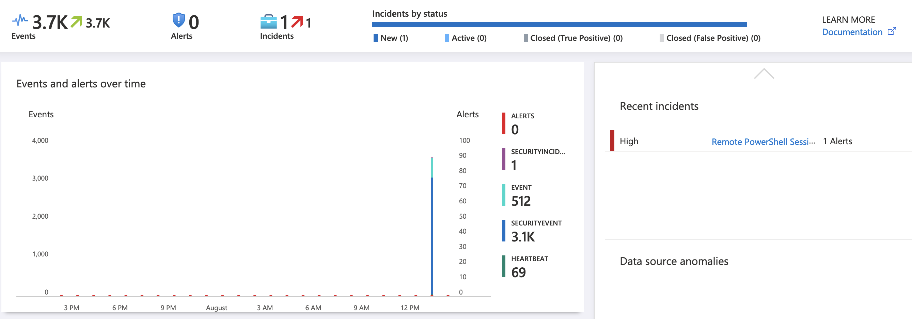

# Adaz-Sentinel: Active Directory Hunting Lab in Azure

 [](https://shields.io/)

This project allows you to **easily spin up Active Directory labs in Azure** using Terraform/Ansible, and forward logs to a log analytics workspace which is connected to Microsoft Sentinel.

## This is a fork of [Adaz by christophetd](https://github.com/christophetd/Adaz).

### What's different in this fork?

1. Microsoft Sentinel is used instead of Kibana (less cost as there is 1 less VM to be deployed)
2. Auditing & QoL changes are deployed via group policy instead of being set locally
3. Workstations are deployed with a range of tools such as: Sysinternals suite, Wireshark, AtomicRedTeam, Notepad++, 7-zip, Chrome, Firefox
4. Includes capability for creating Sentinel alert rules using either:
    - Rules downloaded from the Sigma repository via a script, which are converted to KQL using a modified version of the [sigmac](https://github.com/SigmaHQ/sigma/blob/master/tools/README.md#sigmac) configs.
    - Your own custom sigma rules
    - Your own custom KQL queries


It uses a high-level configuration file for your domain to allow you to customize users, groups and workstations.

 ```yaml
dns_name: hunter.lab
dc_name: DC-1
dc_ip: "10.0.10.10"

initial_domain_admin:
  username: hunter
  password: Hunt3r123.

organizational_units:
- OU=Workstations
- OU=Accounts
- OU=Roles

users:
- username: barry
  OU: OU=Accounts
- username: iris
  OU: OU=Accounts

groups:
- dn: CN=Hunters,OU=Roles
  members: [barry, iris]

default_local_admin:
  username: localadmin
  password: Localadmin!

workstations:
- name: BARRY-WKS
  local_admins: [barry]
- name: IRIS-WKS
  local_admins: [iris]

enable_windows_firewall: no
```

## Features

Here's an incomplete and biased comparison with [Adaz](https://github.com/christophetd/Adaz) & [DetectionLab](https://github.com/clong/DetectionLab):


|FIELD1                                      |Adaz-Sentinel     |Adaz                |DetectionLab      |
|--------------------------------------------|------------------|--------------------|------------------|
|Public cloud support                        |Azure             |Azure               |AWS *Azure ([beta](https://github.com/clong/DetectionLab/tree/master/Azure))*|
|Expected time to spin up a lab              |18-25 minutes     |15-20 minutes       |25 minutes        |
|Log management & querying                   |Microsoft Sentinel|Elasticsearch+Kibana|Splunk Enterprise |
|WEF                                         |:no_entry_sign:   |:heavy_check_mark:  |:heavy_check_mark:|
|Audit policies                              |:heavy_check_mark:|:heavy_check_mark:  |:heavy_check_mark:|
|Sysmon                                      |:heavy_check_mark:|:heavy_check_mark:  |:heavy_check_mark:|
|**YAML domain configuration file**          |:heavy_check_mark:|:heavy_check_mark:  |:no_entry_sign:   |
|**Multiple Windows 10 workstations support**|:heavy_check_mark:|:heavy_check_mark:  |:no_entry_sign:   |
|VirtualBox/VMWare support                   |:no_entry_sign:   |:no_entry_sign:     |:heavy_check_mark:|
|osquery / fleet                             |:no_entry_sign:   |:no_entry_sign:     |:heavy_check_mark:|
|Powershell transcript logging               |:heavy_check_mark:|:no_entry_sign:     |:heavy_check_mark:|
|IDS logs                                    |:no_entry_sign:   |:no_entry_sign:     |:heavy_check_mark:|
|Sigma rules                                 |:heavy_check_mark:|:no_entry_sign:     |:no_entry_sign:   |
|Invoke-AtomicRedTeam                        |:heavy_check_mark:|:no_entry_sign:     |:heavy_check_mark:|


## Use-cases

- **Detection engineering**: Having access to clean lab with a standard is a great way to understand what traces common attacks and lateral movement techniques leave behind.

- **Learning Active Directory**: Useful for testing GPOs or various AD features (AppLocker, LAPS...).

## Screenshots 

<p align="center">
    
    
    
    
    
</p>

## Getting started 

**Note: This has been tested on a M1 Macbook Air, and an Ubuntu VM. I have not tried this on Windows or WSL so please let me know if it works.**

### Prerequisites

- An Azure subscription. You can [create one for free](https://azure.microsoft.com/en-us/free/) and you get $200 of credits for the first 30 days. Note that this type of subscription has a limit of 4 vCPUs per region, which still allows you to run 1 domain controller and 2 workstations (with the default lab configuration).

- [Terraform](https://www.terraform.io/downloads.html) >= 0.12 (Tested on 1.2.5)

- [Azure CLI](https://docs.microsoft.com/en-us/cli/azure/install-azure-cli?view=azure-cli-latest)
- You must be logged in to your Azure account by running `az login`. You can use `az account list` to confirm you have access to your Azure subscription.

### Installation

- Clone this repository

```
git clone https://github.com/Ben4FH/Adaz-Sentinel.git
```

- Create a virtual env and install Ansible dependencies

```bash
# Note: the virtual env needs to be in ansible/venv
cd Adaz-Sentinel/
python3 -m venv ansible/venv 
source ansible/venv/bin/activate
pip install -r ansible/requirements.txt
deactivate
```
- Pull the latest sigma rules and convert them to KQL by using the provided script.
- The first time you run it it will take about 10 minutes as it needs to convert all the rules.
- Subsequent runs will take very little time as it will only convert new rules.

```bash
# Go to the sigma folder
cd terraform/files/sigma
./convert_rules.sh
```

- Initialize Terraform and apply.
- This process will take between 18 and 25 minutes.

```bash
# Go back to the terraform folder
cd ../../
terraform init
terraform apply
```

- Destroy lab when finished using it.
- Please check the azure portal to confirm that the resource group was removed, it may take 5 minutes to delete.
```bash
# More reliable than running terraform destroy
./destroy.sh
```

### Usage

Optionally edit [`domain.yml`](./domain.yml) according to your needs (reference [here](./doc/configuration_reference.md)), then run:

```
terraform apply
```

Resource creation and provisioning takes 18-25 minutes. As long as you do not get any errors, you will have an output similar to the below. If you get an error for a rule, you can add it to [`failed.csv`](./terraform/files/sigma/failed.csv) and it will not use it next time, or you can fix the rule and move it to the [`override folder`](/terraform/files/sigma/override/)

```
dc_public_ip = 13.89.191.140

workstations_public_ips = {
  "BARRY-WKS" = "52.165.182.15"
  "IRIS-WKS" = "52.176.5.229"
}

what_next =
####################
###  WHAT NEXT?  ###
####################

Check your log analytics workspace to make sure logs are being received.
It may take around 2 minutes for the SecurityEvent table to start to populate.
If the below query returns results for the workstations then you should be fine.

SecurityEvent
| where TimeGenerated >= ago(5m)
| where EventID == "4688"
| summarize count() by Computer
```

By default, resources are deployed in the `West Europe` region under a resource group `ad-hunting-lab`. You can control the region with a Terraform variable:

```
terraform apply -var 'region=East US 2'
```

### Documentation

- [Frequently Asked Questions](./doc/faq.md)
- [`domain.yml` reference](./doc/configuration_reference.md)
- [Sigma Rule Conversion](./doc/sigma.md)
- [GPO list](./doc/gpo_list.md)
- [Detailed architecture](./doc/architecture.md)
- [Troubleshooting common issues](./doc/troubleshooting.md)
- [Common Operations: adding users, destroying the lab, etc.](./doc/operations.md)
- [Project structure and directory organization](./doc/structure.md)
- [Terraform variables available](./terraform/vars.tf)


### To Do
- Create additional parser for the SecurityEvent events so that parse_xml is not required in the ala-new.yml file
- Add functionality to ala-new.py to allow keyword searching.

### Suggestions and bugs

Feel free to open an issue.

